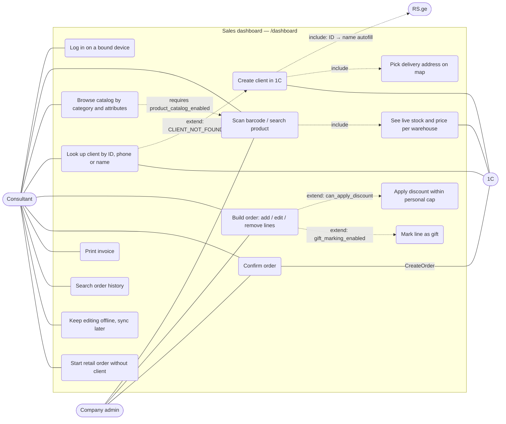
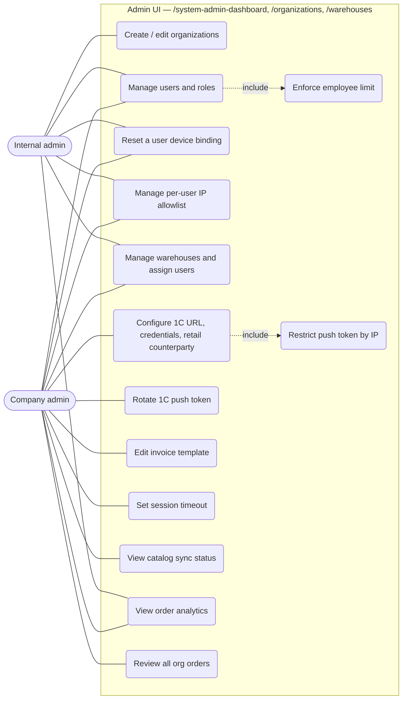
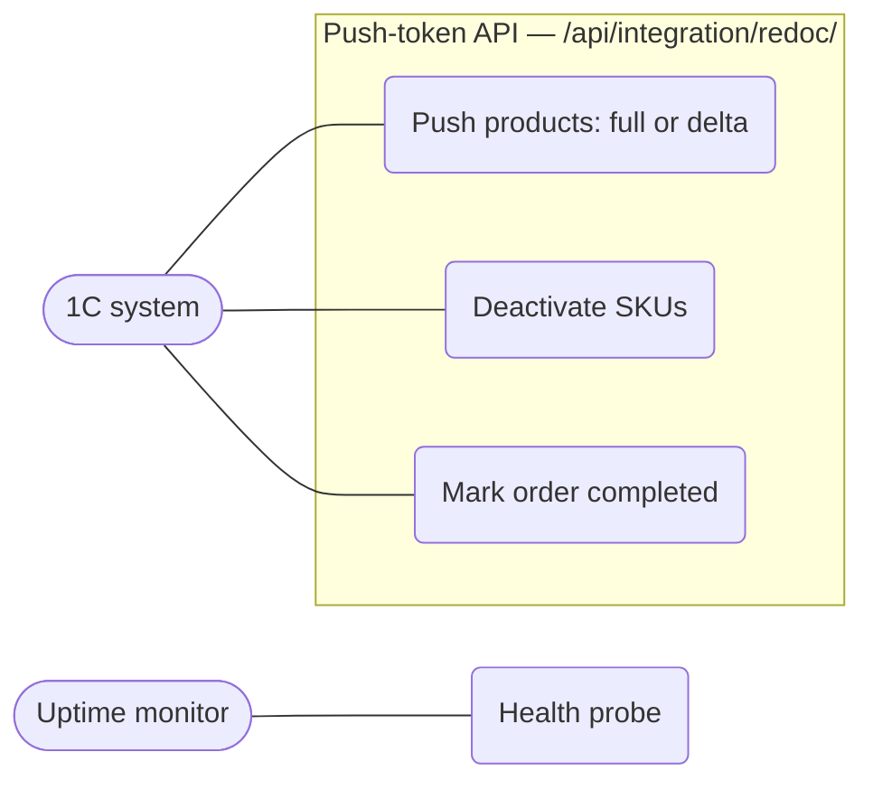

# 01 — Use cases

Mermaid has no native UML use-case diagram, so actors are drawn as stadium
nodes and use cases as rounded nodes grouped by system boundary.

## Actors

| Actor | Identity | Scope |
|-------|----------|-------|
| **Consultant** (`company_user`) | JWT | Own organization; warehouses they are assigned to. Counts against `Organization.employees_count`. |
| **Company admin** (`company_admin`) | JWT | Own organization — users, warehouses, org settings, analytics. Can also sell. |
| **Internal admin** (`internal_admin`) | JWT, `is_staff`/`is_superuser`, no org | All organizations. Also uses Django admin. |
| **1C system** | Per-org push token (+ optional IP allowlist) | Exactly the organization the token belongs to. |
| **Anonymous** | none | Health probe, RS.ge lookup, signed image URLs. |

## Selling (consultant & company admin)

## Administration

Company-admin-only org actions (`external_service`, `rotate_external_service_token`,
`invoice_template`, `security_settings`) are closed to internal admins on purpose —
they have no organization of their own (`core/permissions.py`).

## Integration (1C → app)

## Route access (frontend)

| Route | internal_admin | company_admin | company_user |
|-------|:-:|:-:|:-:|
| `/login` | ✓ | ✓ | ✓ |
| `/dashboard` (sales; landing page for company_user) | | ✓ | ✓ |
| `/system-admin-dashboard` (landing page for admins) | ✓ | ✓ | |
| `/organizations` | ✓ | ✓ | |
| `/warehouses` | ✓ | ✓ | |
| `/admin/` (Django) | ✓ | | |

Source: `barcode-scanner-frontend/src/App.js`. The backend enforces the same split
independently via `core/permissions.py`; the route guard is UX only.

## API permission matrix

| Resource | internal_admin | company_admin | company_user |
|----------|---|---|---|
| Organizations | full CRUD | read own + my-org settings | read own |
| Users | full | CRUD on own org's `company_user`s | — |
| Warehouses | full | CRUD in own org | read (assigned only) |
| Orders, product search, catalog read, clients | — | own org | own org |
| Catalog sync status | — | own org | — |
| Order analytics | all | own org | — |
