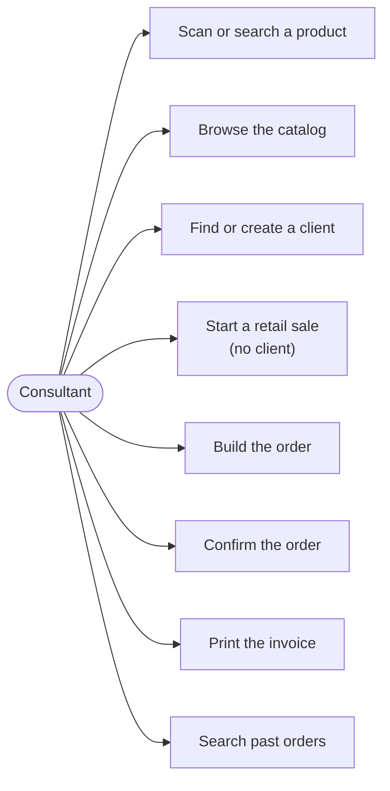
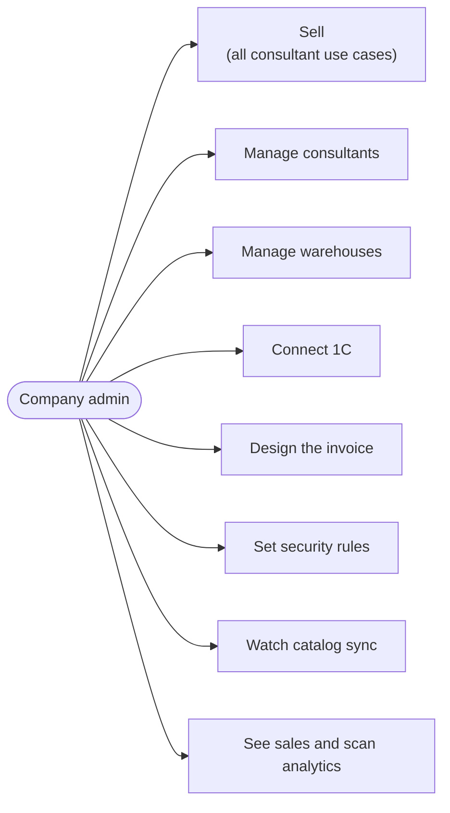
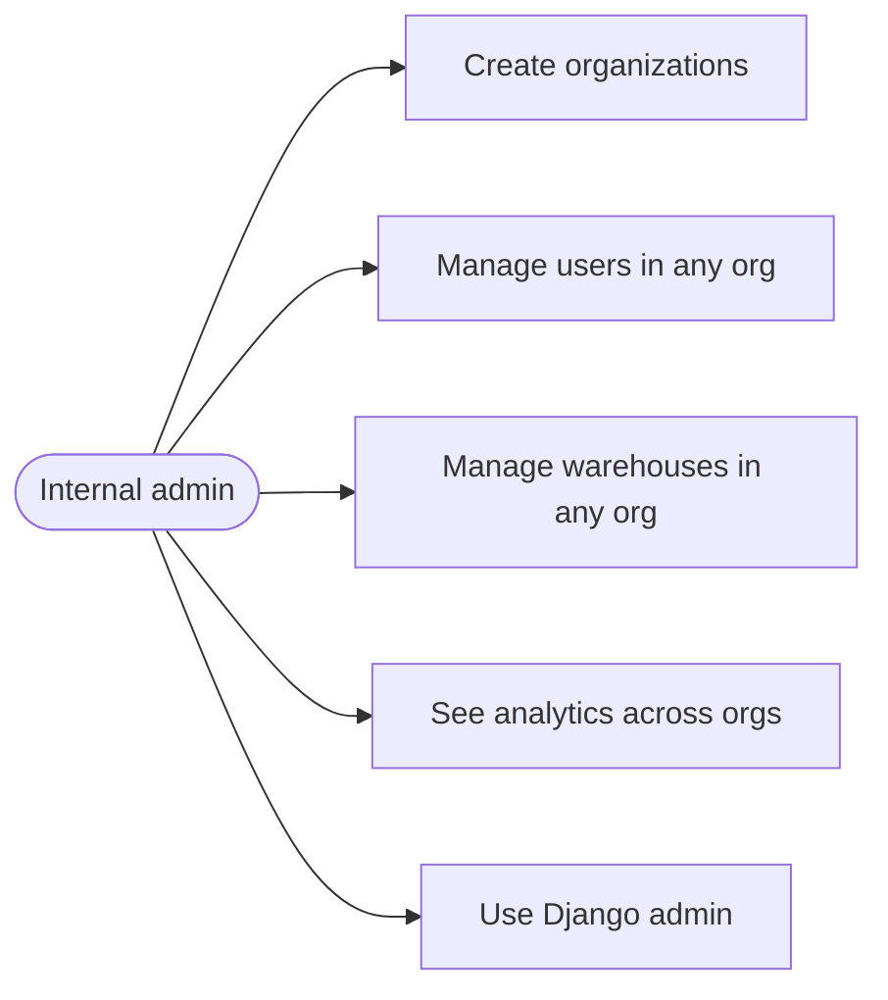
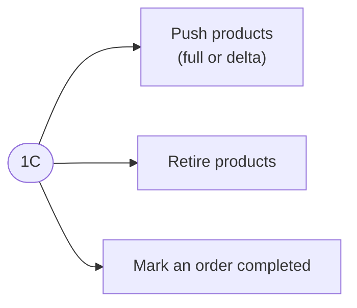

# 01 — Use cases

One diagram per actor, so no lines cross. Mermaid has no UML use-case type:
actors are rounded pills, use cases are boxes. Dependencies between use cases
("include" / "extend") are listed in a table instead of drawn.

## Consultant (`company_user`)

Sells from the `/dashboard` page, scoped to their organization and the
warehouses they are assigned to.

## Company admin (`company_admin`)

Everything a consultant can do, plus running their organization from
`/system-admin-dashboard`.

## Internal admin (`internal_admin`)

Runs the platform across organizations; has no organization of its own.

## 1C (machine actor)

Authenticated by the organization's push token, never by a user login.

## What each use case involves

| Use case | Includes | Only when |
|----------|----------|-----------|
| Scan or search a product | Live stock and price per warehouse from 1C | — |
| Browse the catalog | Categories, attribute filters | Org has `product_catalog_enabled` |
| Find or create a client | Lookup in 1C by ID, phone or name → create on `CLIENT_NOT_FOUND`; RS.ge fills the name from a tax ID; map picker for the address | — |
| Build the order | Add / edit / remove lines, pick warehouse | — |
| ↳ apply a discount | Capped at the user's `max_discount_percent` | User has `can_apply_discount` |
| ↳ mark a line as a gift | Informational, never changes the total | Org has `gift_marking_enabled` |
| ↳ keep working offline | Edits queue on the device and sync later | Connection lost |
| Confirm the order | Stock check, then creates the order in 1C — see [03](03-order-lifecycle.md) | — |
| Manage consultants | Employee limit, reset device binding, IP allowlist | — |
| Connect 1C | URL, credentials, retail counterparty, rotate push token, push IP allowlist | — |
| Set security rules | Session timeout | — |

Company-admin-only org actions (`external_service`, `rotate_external_service_token`,
`invoice_template`, `security_settings`) are closed to internal admins on purpose —
they have no organization of their own (`core/permissions.py`).

## Route access (frontend)

| Route | internal_admin | company_admin | company_user |
|-------|:-:|:-:|:-:|
| `/login` | ✓ | ✓ | ✓ |
| `/dashboard` (sales; landing page for company_user) | | ✓ | ✓ |
| `/system-admin-dashboard` (landing page for admins) | ✓ | ✓ | |
| `/organizations` | ✓ | ✓ | |
| `/warehouses` | ✓ | ✓ | |
| `/admin/` (Django) | ✓ | | |

Source: `barcode-scanner-frontend/src/App.js`. The backend enforces the same split
independently via `core/permissions.py`; the route guard is UX only.

## API permission matrix

| Resource | internal_admin | company_admin | company_user |
|----------|---|---|---|
| Organizations | full CRUD | read own + my-org settings | read own |
| Users | full | CRUD on own org's `company_user`s | — |
| Warehouses | full | CRUD in own org | read (assigned only) |
| Orders, product search, catalog read, clients | — | own org | own org |
| Catalog sync status | — | own org | — |
| Order and scan analytics | all | own org | — |
