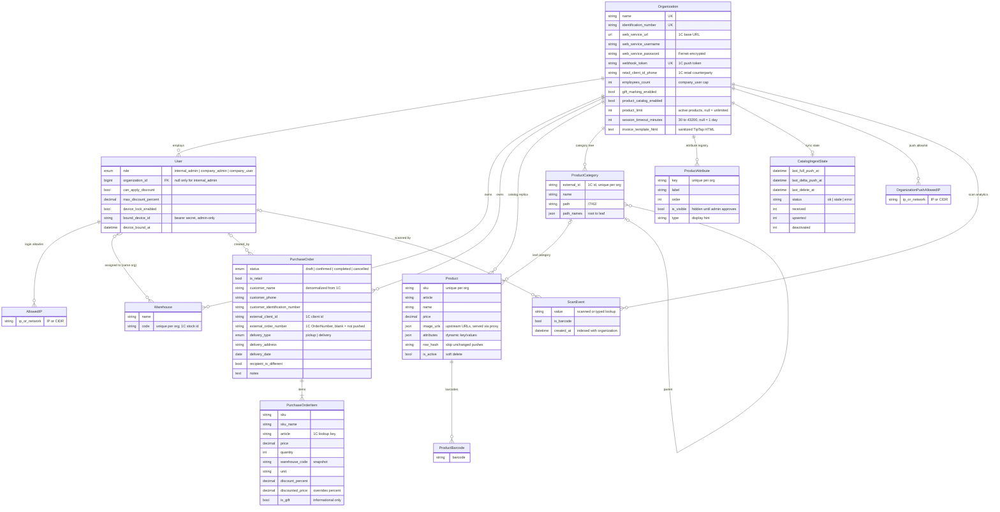
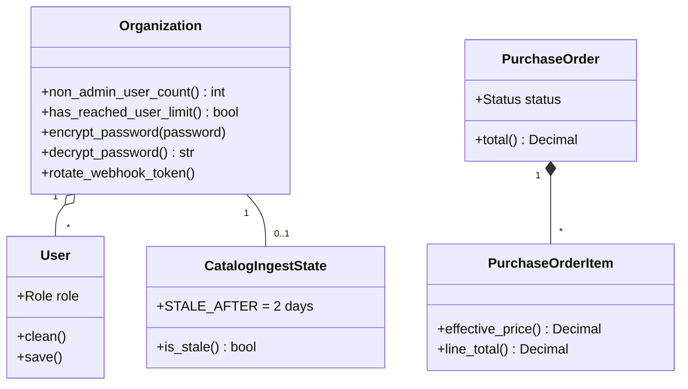

# 02 — Domain model

Source: `backend/users/models.py`, `backend/core/models.py`.

## Entity–relationship diagram

## Invariants the diagram cannot show

| Rule | Where enforced |
|------|----------------|
| `internal_admin` has no org and `is_staff` or `is_superuser`; company roles must have an org | `User.clean()`, run on every `save()` |
| Number of `company_user` accounts ≤ `employees_count` (admins excluded) | `UsersViewSet.create` → `USER_LIMIT_REACHED` |
| User ↔ Warehouse links are same-org only | Serializers + admin forms (not the DB — `limit_choices_to` is a no-op) |
| Active products ≤ `product_limit` | Catalog ingest → `PRODUCT_LIMIT_REACHED`, whole push rejected |
| One open **draft** per client per org | `PurchaseOrderViewSet.create` returns the existing draft |
| Order lines never FK to `Product` | By design — lines snapshot sku/name/price/warehouse so history survives catalog changes and deactivation |
| A line's effective price = `discounted_price` ?? `price × (1 − discount_percent/100)`; gifts do not change totals | `PurchaseOrderItem.effective_price` |
| Discount ≤ user's `max_discount_percent`, only if `can_apply_discount` | `_enforce_discount_permission` in `core/views/orders.py` |
| A `ScanEvent` exists only for lookups the dashboard marked `record_scan` (camera scan, catalog pick, history re-run) — not cart stock refreshes, "other warehouses" re-runs or offline replay | `ProductSearchAPIView._record_scan`; flag set in `UserDashboard.handleSearch` callers |

## Class view — behaviour on models

