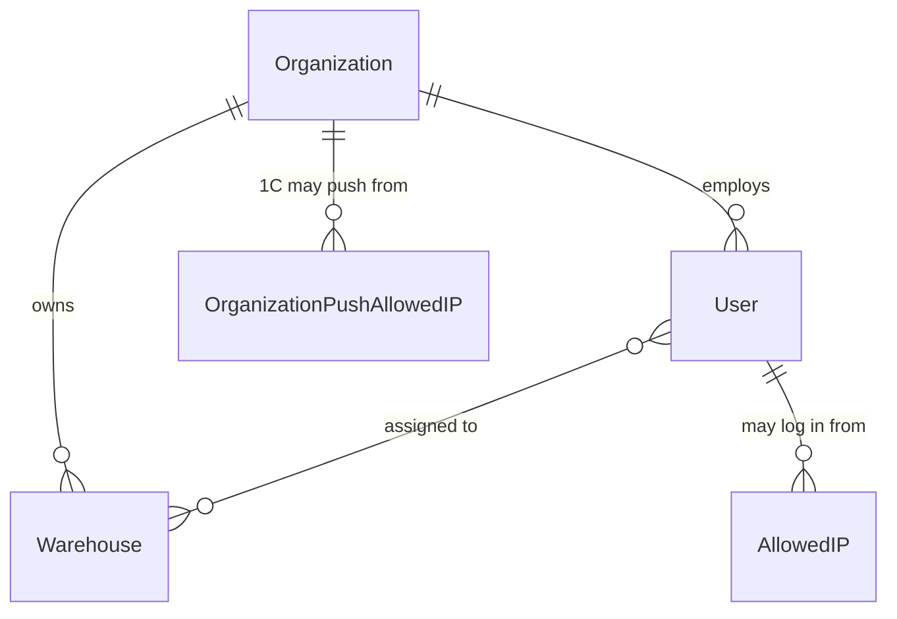
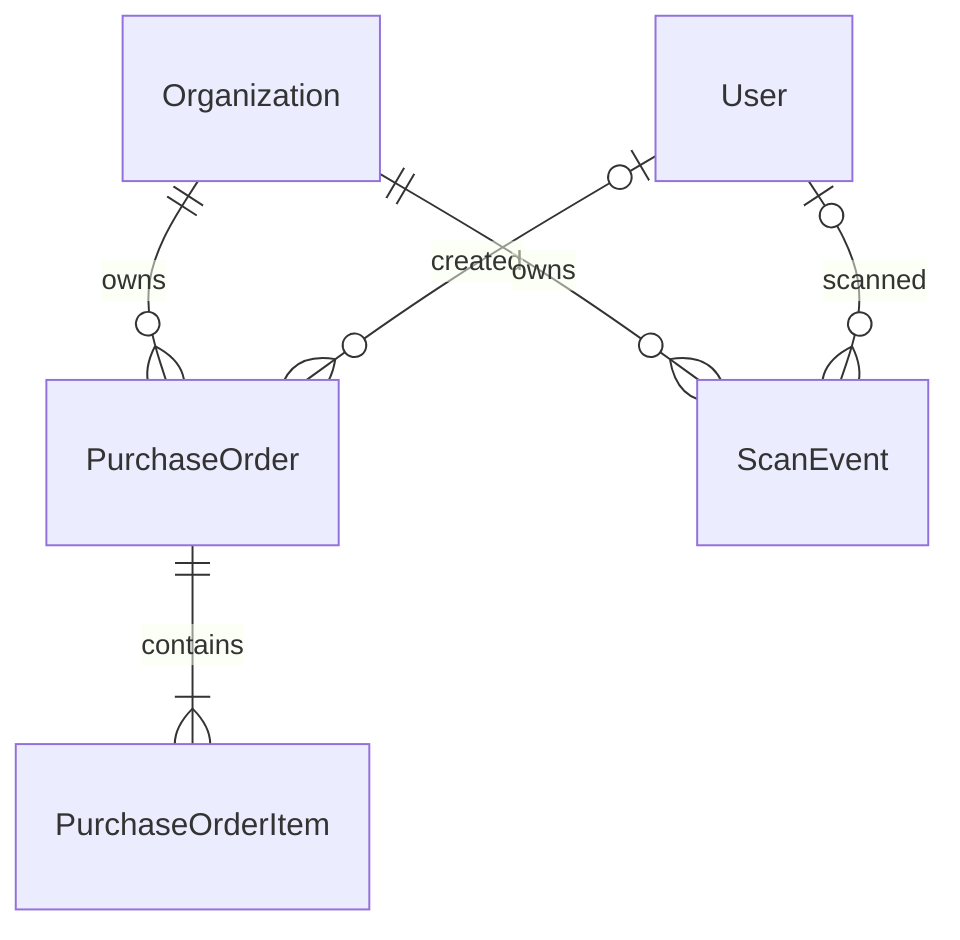
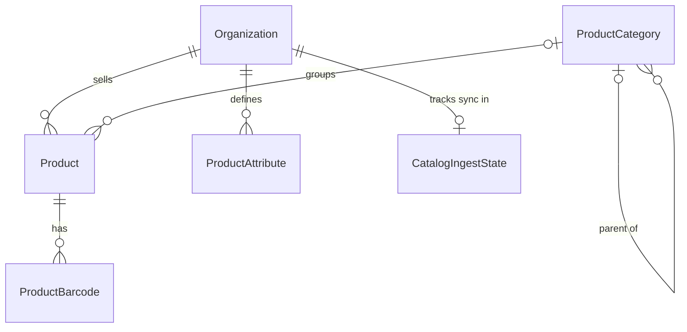

# 02 — Domain model

Source: `backend/users/models.py`, `backend/core/models.py`.

Every row belongs to an **Organization**, so the model is drawn as three small
groups that all hang off it. Diagrams show relationships only; fields are in
the tables under each one.

## Access — who can sign in, from where

| Model | Key fields |
|-------|------------|
| **Organization** | `name`, `identification_number` (both unique) · 1C: `web_service_url`, `web_service_username`, `web_service_password` (Fernet-encrypted), `webhook_token` (push token), `retail_client_id_phone` · limits: `employees_count` (caps company users), `product_limit` (active products, null = unlimited) · switches: `gift_marking_enabled`, `product_catalog_enabled` · `session_timeout_minutes` (30–43200, null = 1 day) · invoice branding + `invoice_template_html` |
| **User** | `role` (internal_admin / company_admin / company_user), `organization` (null only for internal admin) · discounts: `can_apply_discount`, `max_discount_percent` · device lock: `device_lock_enabled`, `bound_device_id` (secret, admin-only), `device_bound_at` |
| **Warehouse** | `name`, `code` (unique per org; the 1C stock id) |
| **AllowedIP** / **OrganizationPushAllowedIP** | `ip_or_network` (IP or CIDR). No rows = unrestricted |

## Sales — orders and scans

| Model | Key fields |
|-------|------------|
| **PurchaseOrder** | `status` (draft / confirmed / completed / cancelled) · client copied from 1C: `customer_name`, `customer_phone`, `customer_identification_number`, `external_client_id` · `is_retail` · `external_order_number` (1C number, blank = not sent yet) · delivery: `delivery_type` (pickup / delivery), address, date, time window · optional different recipient · `notes` |
| **PurchaseOrderItem** | Snapshot of the product: `sku`, `sku_name`, `article`, `price`, `unit` · `quantity`, `warehouse_code` / `warehouse_name` · `discount_percent` or `discounted_price` (the latter wins) · `is_gift` |
| **ScanEvent** | `value`, `is_barcode`, `created_at` — one consultant-started lookup, for analytics |

Order items deliberately have **no link to `Product`**: they copy what was sold,
so order history survives price changes and retired products.

## Catalog — the local copy of 1C's products

| Model | Key fields |
|-------|------------|
| **Product** | `sku` (unique per org), `article`, `name`, `price`, `image_urls`, `attributes` (free key/values), `row_hash` (skips unchanged pushes), `is_active` (retired products are hidden, never deleted) |
| **ProductBarcode** | `barcode` |
| **ProductCategory** | `external_id` (1C id, unique per org), `name`, `path` (e.g. `/7/42/`), `path_names` |
| **ProductAttribute** | `key`, `label`, `order`, `is_visible` (hidden until an admin approves), `type` (display hint) — metadata only; values live on `Product.attributes` |
| **CatalogIngestState** | `last_full_push_at`, `last_delta_push_at`, `last_delete_at`, `status`, counts of the last push. Stale after 2 days without a push |

## Rules the diagrams cannot show

| Rule | Where enforced |
|------|----------------|
| `internal_admin` has no org and `is_staff` or `is_superuser`; company roles must have an org | `User.clean()`, run on every `save()` |
| Number of `company_user` accounts ≤ `employees_count` (admins excluded) | `UsersViewSet.create` → `USER_LIMIT_REACHED` |
| User ↔ Warehouse links are same-org only | Serializers + admin forms (not the DB — `limit_choices_to` is a no-op) |
| Active products ≤ `product_limit` | Catalog ingest → `PRODUCT_LIMIT_REACHED`, whole push rejected |
| One open **draft** per client per org | `PurchaseOrderViewSet.create` returns the existing draft |
| A line's effective price = `discounted_price` ?? `price × (1 − discount_percent/100)`; gifts do not change totals | `PurchaseOrderItem.effective_price` |
| Discount ≤ user's `max_discount_percent`, only if `can_apply_discount` | `_enforce_discount_permission` in `core/views/orders.py` |
| A `ScanEvent` exists only for lookups the dashboard marked `record_scan` (camera scan, catalog pick, history re-run) — not cart stock refreshes, "other warehouses" re-runs or offline replay | `ProductSearchAPIView._record_scan`; flag set in `UserDashboard.handleSearch` callers |
