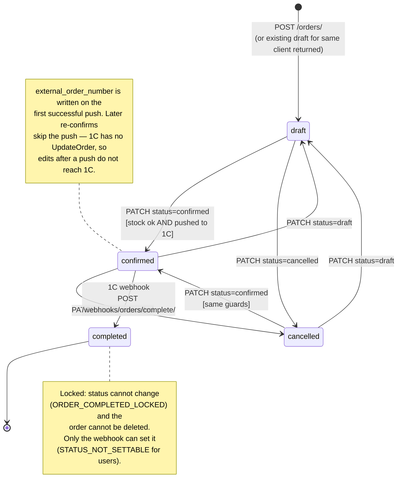
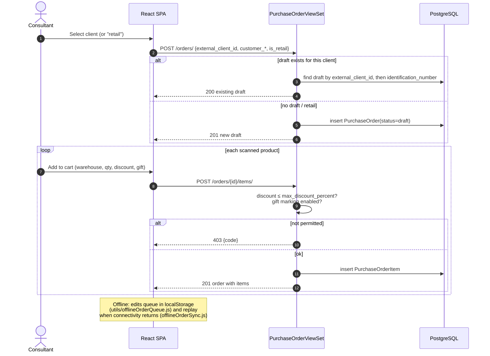
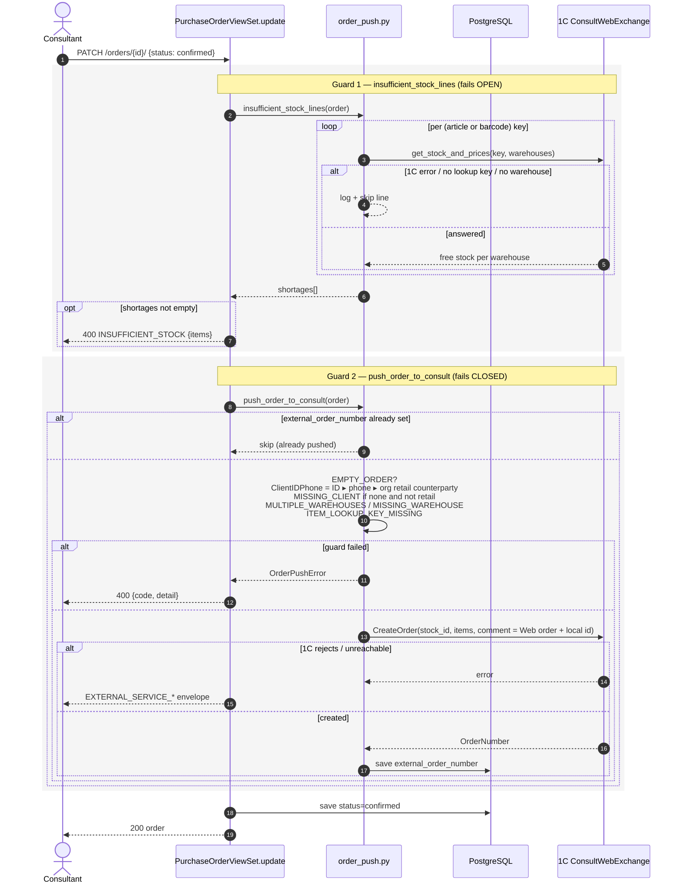
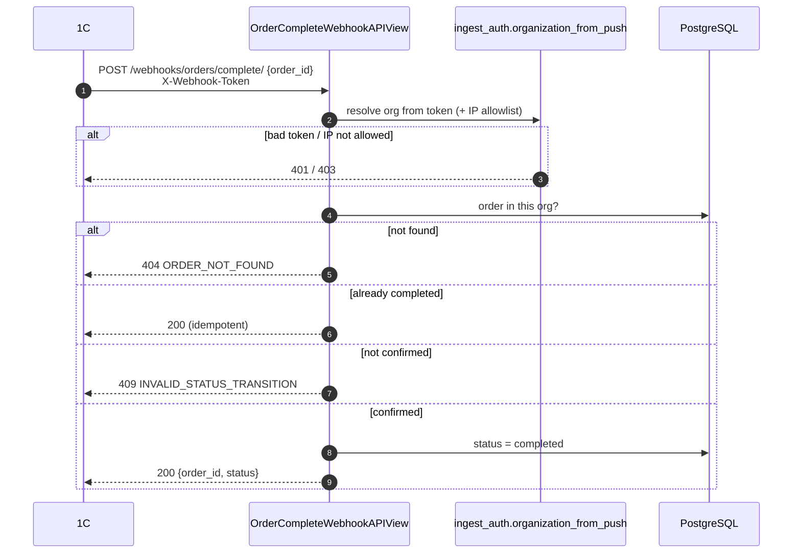

# 03 — Order lifecycle

Source: `backend/core/views/orders.py`, `backend/core/services/order_push.py`,
`backend/core/views/catalog_ingest.py` (`OrderCompleteWebhookAPIView`).

## State machine

The API does not restrict transitions among `draft`, `confirmed` and `cancelled`
beyond the confirm guards; every non-completed order can be deleted.

## Building the order (draft)

## Confirm → push to 1C

Two guards with deliberately opposite failure modes: the stock check **fails open**
(a 1C outage must not freeze the sales floor), the CreateOrder push **fails closed**
(a confirmed order missing from 1C could never be completed).

## Completion (1C → app)

The org always comes from the token, never the body — a token for org A cannot
complete an order in org B.
