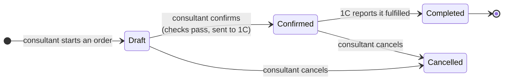
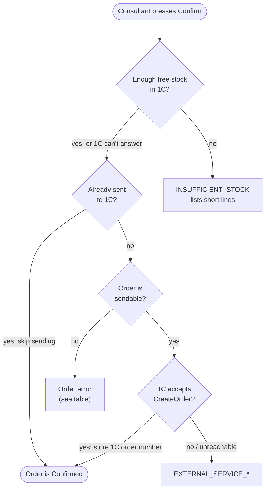
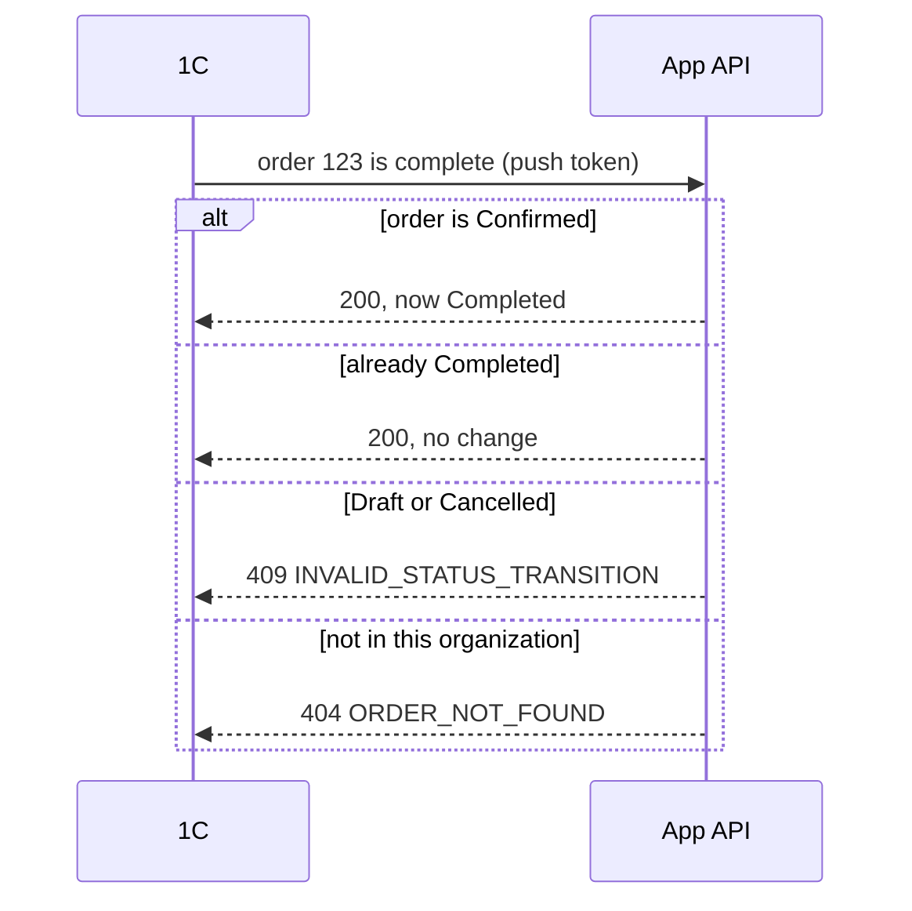

# 03 — Order lifecycle

Source: `backend/core/views/orders.py`, `backend/core/services/order_push.py`,
`backend/core/views/catalog_ingest.py` (`OrderCompleteWebhookAPIView`).

## The normal path

- **Completed is final.** Only 1C can set it, and afterwards the order can't be
  changed or deleted (`ORDER_COMPLETED_LOCKED`; users get `STATUS_NOT_SETTABLE`).
- **Starting an order for a client who already has a draft reopens that draft**
  instead of creating a second one. Retail orders (no client) always start fresh.

### Less common transitions the API also allows

| From | To | Notes |
|------|----|-------|
| Confirmed | Draft | Allowed. If the order was already sent to 1C, 1C keeps the original — there is no update call. |
| Cancelled | Draft | Allowed. |
| Cancelled | Confirmed | Allowed; runs the same confirm checks. |
| any except Completed | deleted | Allowed. |

## What happens on Confirm

Checks run top to bottom; the first failure stops the confirm and returns its code.

The two 1C steps fail in opposite directions on purpose:

- **Stock check lets the order through when 1C can't answer** (outage, no lookup
  key, no warehouse). A 1C hiccup must not stop the sales floor; 1C is still the
  final authority when the order lands there.
- **CreateOrder blocks the confirm when it fails.** A confirmed order that doesn't
  exist in 1C could never be completed.

| "Order is sendable?" failure | Meaning |
|------------------------------|---------|
| `EMPTY_ORDER` | No lines |
| `MISSING_CLIENT` | Not retail, and no client ID, phone or org retail counterparty to send |
| `MULTIPLE_WAREHOUSES` | 1C takes one warehouse per order |
| `MISSING_WAREHOUSE` | Lines have no warehouse |
| `ITEM_LOOKUP_KEY_MISSING` | A line has neither an article nor a known barcode 1C can resolve |

The client sent to 1C is the first non-blank of: client ID number → client phone →
the org's retail counterparty. A retail order with none of them is sent without a
client. The comment sent to 1C carries `Web order #<id>`, which is how 1C knows
which order to complete later.

## Completion (1C → app)

The organization comes from the token, never the request body, so one org's token
can't complete another org's order.
