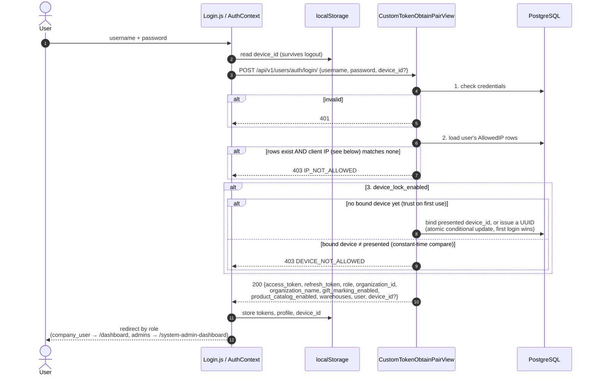
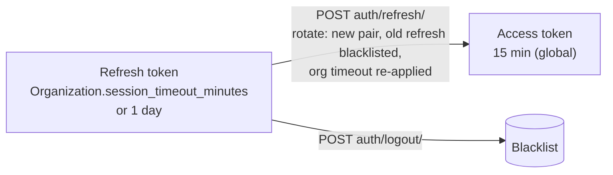
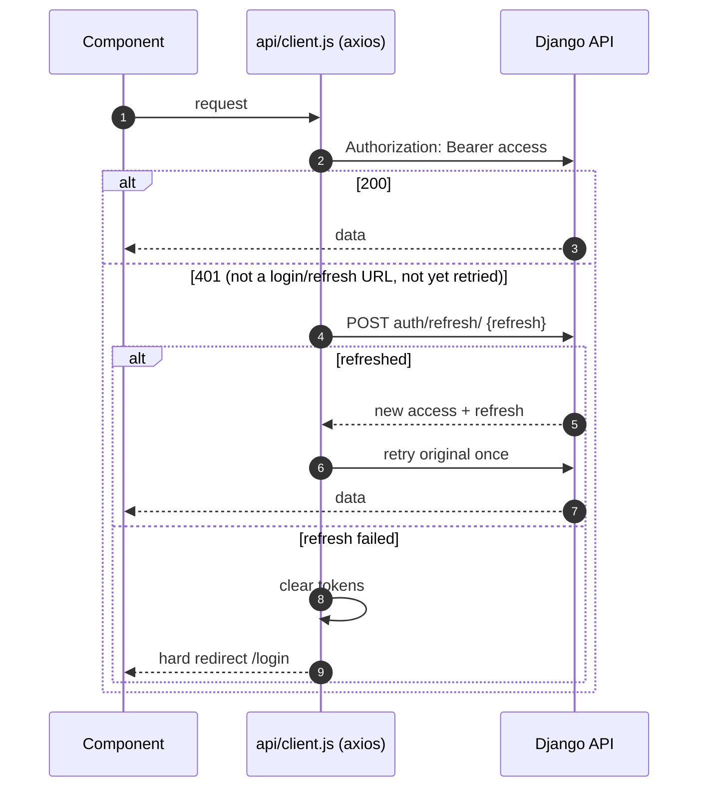

# 04 — Authentication

Source: `backend/users/serializers.py` (`CustomTokenObtainPairSerializer`,
`CustomTokenRefreshSerializer`), `backend/users/views.py`,
`barcode-scanner-frontend/src/api/client.js`, `src/components/Auth/AuthContext.js`.

## Login

A new top-level key in the login response is dropped by the frontend unless it is
threaded through `Login.js` → `AuthContext.login(...)` → its localStorage write →
state restore → `logout()` cleanup.

**Client IP** (`core/ip_utils.py::get_client_ip`, shared with the push-token
allowlist and `GET /users/ip/`) comes from exactly one source per deployment:

| Deployment | Setting | Address used |
|------------|---------|--------------|
| DigitalOcean | `CLIENT_IP_HEADER=DO-Connecting-IP` | that header, set by DO's edge |
| On-prem bundle | `TRUSTED_PROXY_COUNT=1` | the `X-Forwarded-For` entry our nginx wrote |
| Neither set | — | `REMOTE_ADDR` |

The first `X-Forwarded-For` entry is never trusted: the client writes it. When the
configured source is missing, the address is unknown and an allowlisted login fails.

## Token lifetimes

The refresh lifetime is effectively an **idle timeout**: each rotation restarts it,
so an active user stays signed in while an idle one expires.

## Request with transparent refresh

## Admin controls

| Control | Who | Effect |
|---------|-----|--------|
| `POST /users/{id}/reset-device/` | company admin / internal admin | Clears binding; next login re-binds |
| Per-user `AllowedIP` | admins | Restrict login to IPs / CIDRs |
| `session_timeout_minutes` | company admin (security settings) | Idle timeout for the org |
| `OrganizationPushAllowedIP` | company admin | Restrict 1C push token by source IP |
| Rotate push token | company admin | Invalidates the old 1C token immediately |
