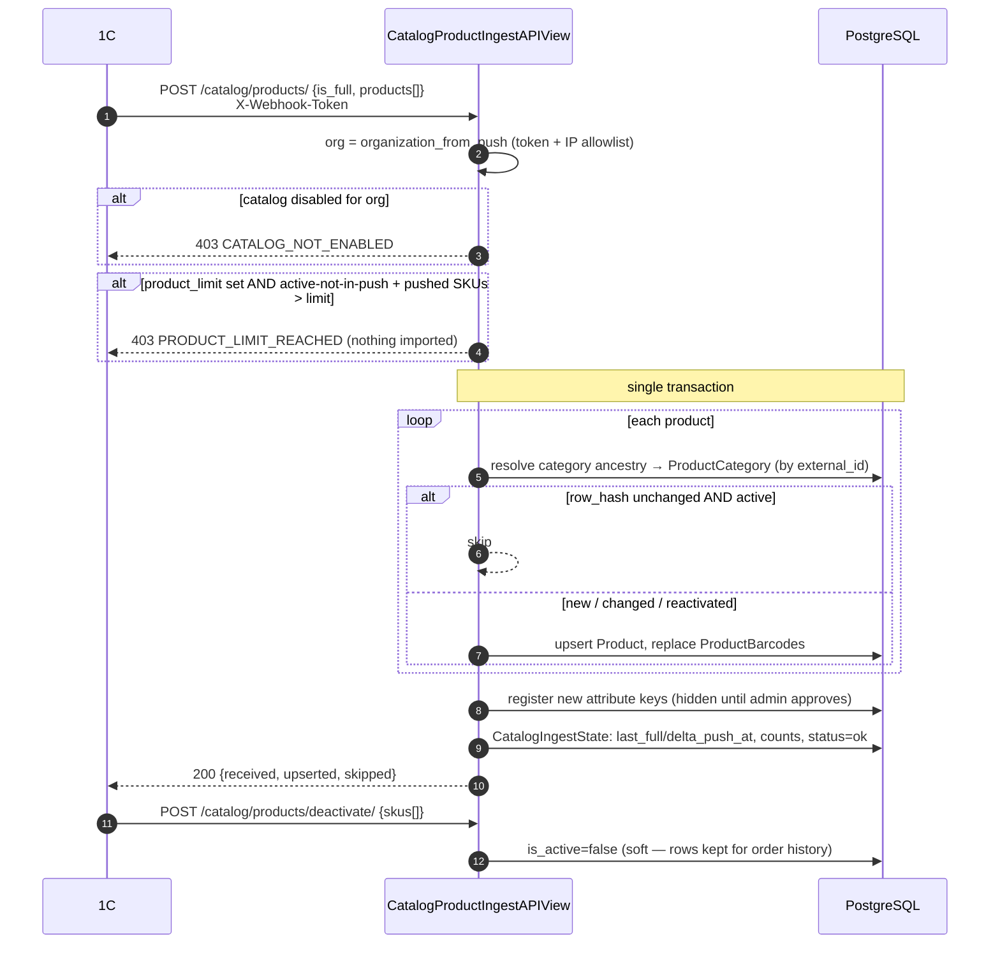
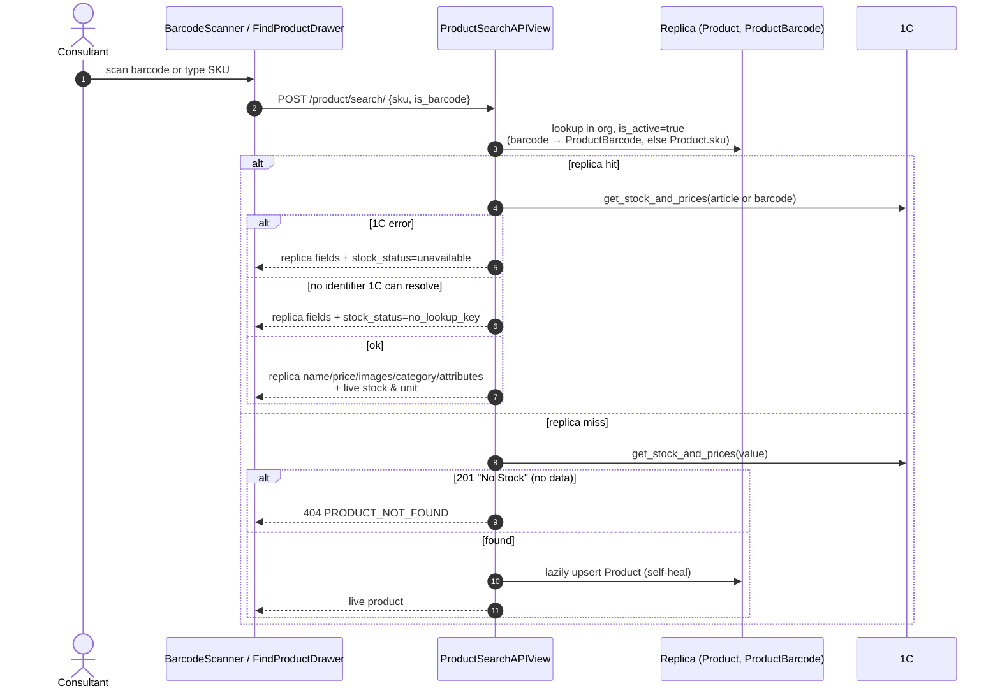
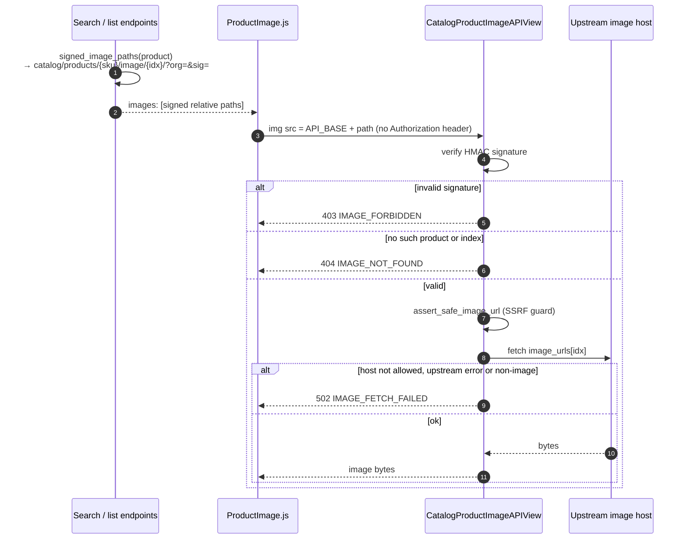

# 05 — Catalog replica & product search

Source: `backend/core/views/catalog_ingest.py`, `backend/core/views/catalog_read.py`,
`backend/core/views/products.py`, `backend/core/catalog/`.

The catalog is a per-org **replica** of 1C's nomenclature, pushed by 1C. It is
enabled per org (`product_catalog_enabled`). Price, name, images, category and
attributes come from the replica; **stock is always live** from 1C.

## Catalog push (1C → app)

`CatalogIngestState.is_stale` turns true when no push has arrived for 2 days;
company admins see it on the catalog sync-status view.

## Scan → product card (replica-first)

## Product images (signed proxy)

Images are never inlined and the frontend never builds these URLs itself — it only
joins the backend-minted path onto the API base.

## Catalog browsing (read side)

| Endpoint | Purpose | Who |
|----------|---------|-----|
| `GET catalog/categories/tree/` | Category tree for tiles / cascader | company user & admin |
| `GET catalog/products/list/` | Paginated list, category & attribute filters | company user & admin |
| `GET catalog/products/search/` | Text search in replica | company user & admin |
| `GET catalog/sync-status/` | `CatalogIngestState` + staleness | company admin |
