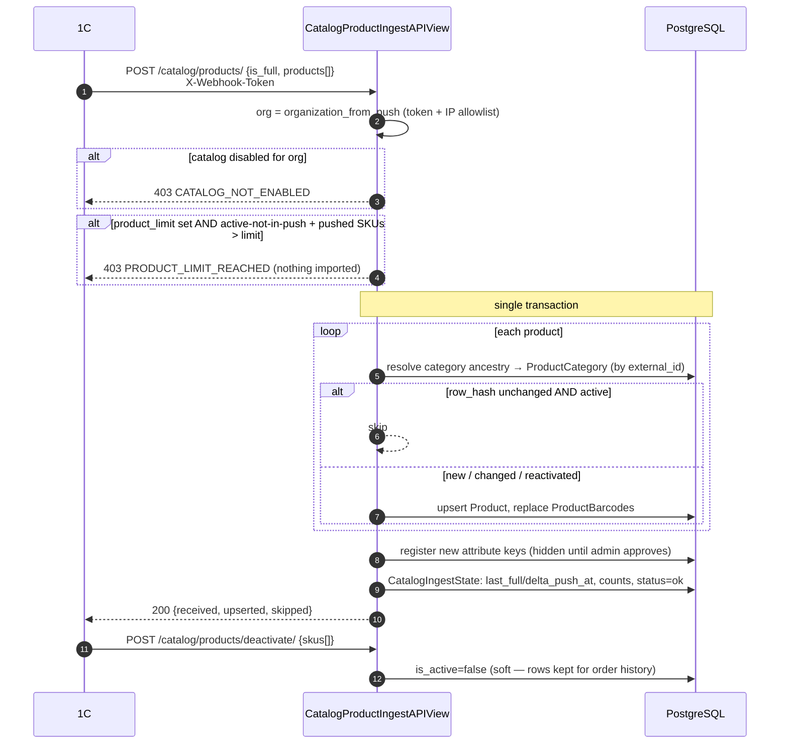
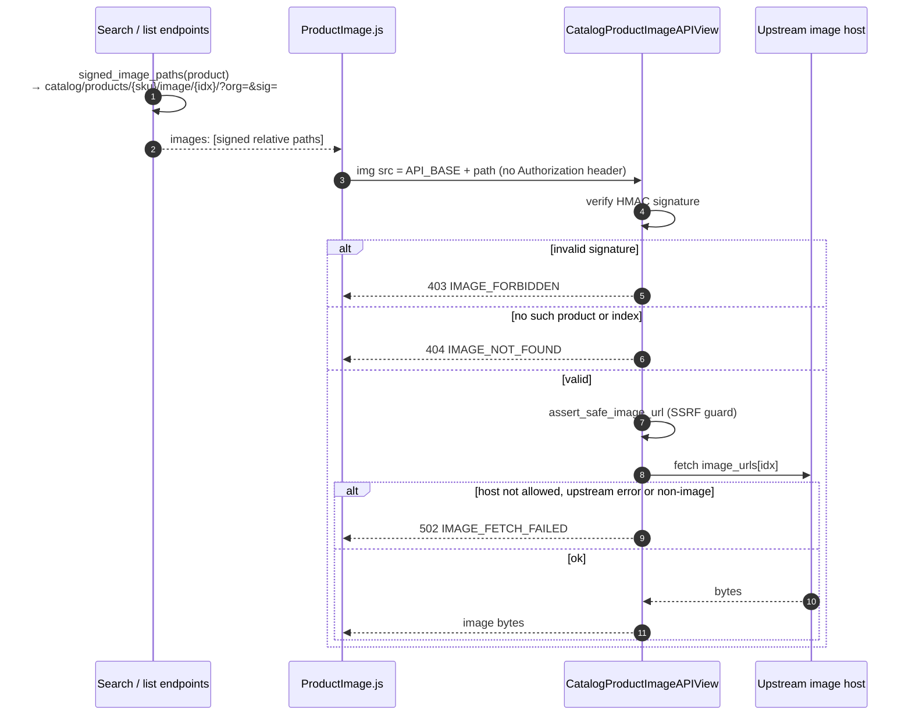

# 05 — Catalog replica & product search

Source: `backend/core/views/catalog_ingest.py`, `backend/core/views/catalog_read.py`,
`backend/core/views/products.py`, `backend/core/views/product_stock.py`,
`backend/core/services/stock_batch.py`, `backend/core/catalog/`.

The catalog is a per-org **replica** of 1C's nomenclature, pushed by 1C. It is
enabled per org (`product_catalog_enabled`). Price, name, images, category and
attributes come from the replica; **stock is always live** from 1C.

## Catalog push (1C → app)

```mermaid
sequenceDiagram
    autonumber
    participant OneC as 1C
    participant V as CatalogProductIngestAPIView
    participant DB as PostgreSQL

    OneC->>V: POST /catalog/products/ {is_full, products[]}<br/>X-Webhook-Token
    V->>V: org = organization_from_push (token + IP allowlist)
    alt catalog disabled for org
        V-->>OneC: 403 CATALOG_NOT_ENABLED
    end
    alt product_limit set AND active-not-in-push + pushed SKUs > limit
        V-->>OneC: 403 PRODUCT_LIMIT_REACHED (nothing imported)
    end

    Note over V,DB: single transaction
    loop each product
        V->>DB: resolve category ancestry → ProductCategory (by external_id)
        alt row_hash unchanged AND active
            V-->>V: skip
        else new / changed / reactivated
            V->>DB: upsert Product, replace ProductBarcodes
        end
    end
    V->>DB: register new attribute keys (hidden until admin approves)
    V->>DB: CatalogIngestState: last_full/delta_push_at, counts, status=ok
    V-->>OneC: 200 {received, upserted, skipped}

    OneC->>V: POST /catalog/products/deactivate/ {skus[]}
    V->>DB: is_active=false (soft — rows kept for order history)
```

`CatalogIngestState.is_stale` turns true when no push has arrived for 2 days;
company admins see it on the catalog sync-status view.

## Scan → product card (two endpoints, in parallel)

One scan is two independent requests, fired together. The catalog read is a
pure local query that renders the card in milliseconds; the stock call is the
only half that waits on 1C. Neither can answer "this product does not exist" on
its own — the catalog only knows it is not in the replica, and 1C's data-less
201 only becomes a verdict once the replica has also missed — so the verdict is
assembled on the client (`components/UserDashboard/scanLookup.js::scanVerdict`).

```mermaid
sequenceDiagram
    autonumber
    actor C as Consultant
    participant FE as UserDashboard.handleSearch
    participant PS as ProductSearchAPIView
    participant ST as ProductStockAPIView<br/>(stock_batch)
    participant DB as Replica (Product, ProductBarcode)
    participant OneC as 1C

    C->>FE: scan barcode or type SKU
    par catalog — local only, never fails on 1C
        FE->>PS: POST /product/search/ {sku, is_barcode, record_scan}
        opt record_scan = true (user-started lookup)
            PS->>DB: insert ScanEvent (failure logged, never blocks)
        end
        PS->>DB: lookup in org, is_active=true<br/>(barcode → ProductBarcode, else Product.sku)
        alt replica hit
            PS-->>FE: name/price/images/category/attributes<br/>+ stock_status=pending (vestigial)
        else replica miss
            PS-->>FE: 404 PRODUCT_NOT_IN_CATALOG<br/>("not in the replica", NOT "does not exist")
        end
    and stock — the only 1C caller, always 200
        FE->>ST: POST /product/stock/ {items[], warehouses}
        ST->>DB: phase A: requested value → replica row → 1C lookup key
        alt the replica row holds no article and no barcode
            ST->>ST: status=no_lookup_key (1C is never asked)
        else
            ST->>OneC: phase B: get_stock_and_prices per item<br/>(pool threads, no ORM, 25 s deadline)
            alt 1C answered
                ST->>ST: status=ok (an empty stock list = out of stock)
                opt replica missed AND 1C returned identity
                    ST->>DB: phase C: upsert Product (self-heal)
                    ST->>ST: echo it back as product
                end
            else replica missed AND 1C could not resolve it
                ST->>ST: status=not_found
            else 1C error, timeout, or past the deadline
                ST->>ST: status=unavailable<br/>(a replica HIT is never not_found)
            end
        end
        ST-->>FE: 200 {results: [{sku, status, stock, unit?, product?}]}
    end
    FE->>C: card as soon as the catalog answers;<br/>stock rows when the stock call lands
```

The card renders on whichever answer is useful first: a catalog hit paints it
immediately with a stock skeleton; a catalog miss holds "checking 1C…" until the
stock call either echoes an identity (render it) or reports `not_found` (only
then, `PRODUCT_NOT_FOUND` to the consultant). Anything else is "the service is
unreachable", never "no such product".

## Product images (signed proxy)

```mermaid
sequenceDiagram
    autonumber
    participant API as Search / list endpoints
    participant FE as ProductImage.js
    participant IMG as CatalogProductImageAPIView
    participant Up as Upstream image host

    API->>API: signed_image_paths(product)<br/>→ catalog/products/{sku}/image/{idx}/?org=&sig=
    API-->>FE: images: [signed relative paths]
    FE->>IMG: img src = API_BASE + path (no Authorization header)
    IMG->>IMG: verify HMAC signature
    alt invalid signature
        IMG-->>FE: 403 IMAGE_FORBIDDEN
    else no such product or index
        IMG-->>FE: 404 IMAGE_NOT_FOUND
    else valid
        IMG->>IMG: assert_safe_image_url (SSRF guard)
        IMG->>Up: fetch image_urls[idx]
        alt host not allowed, upstream error or non-image
            IMG-->>FE: 502 IMAGE_FETCH_FAILED
        else ok
            Up-->>IMG: bytes
            IMG-->>FE: image bytes
        end
    end
```

Images are never inlined and the frontend never builds these URLs itself — it only
joins the backend-minted path onto the API base.

## Catalog browsing (read side)

| Endpoint | Purpose | Who |
|----------|---------|-----|
| `GET catalog/categories/tree/` | Category tree for tiles / cascader | company user & admin |
| `GET catalog/products/list/` | Paginated list, category & attribute filters | company user & admin |
| `GET catalog/products/search/` | Text search in replica | company user & admin |
| `GET catalog/sync-status/` | `CatalogIngestState` + staleness | company admin |
