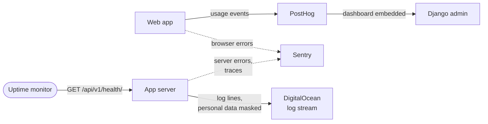

# 06 — Monitoring

Source: `backend/backend/sentry.py`, `backend/core/views/health.py`,
`backend/core/log_redaction.py`, `backend/backend/settings.py` (`LOGGING`,
`POSTHOG_DASHBOARD_URL`), `barcode-scanner-frontend/src/index.js`,
`src/observability/`, and the rollout record in
[`docs/superpowers/specs/2026-09-09-sentry-error-monitoring-design.md`](../superpowers/specs/2026-09-09-sentry-error-monitoring-design.md).

Five signals, each answering a different question. None of them overlap on
purpose: the health probe says *whether* the app is up, Sentry says *what broke*,
logs say *what happened to one request*, PostHog says *how people use it*, and the
in-app views tell admins about *their own business*.

## Where each signal goes

Dotted lines are Sentry, which sends nothing unless a DSN is configured.

## Which tool answers which question

| Question | Look at | What you get |
|----------|---------|--------------|
| Is the app up? | Uptime monitor → `GET /api/v1/health/` | `200 {"status": "ok"}`, or `503 DATABASE_UNAVAILABLE` when Postgres doesn't answer `SELECT 1`. Never calls 1C, Photon or RS.ge, so a slow partner can't make the app look down |
| Is something broken? | Sentry (Django + React projects) | Grouped exceptions from the server and the browser, tagged with environment and release (git SHA) |
| Why was this request slow? | Sentry traces | Every 1C / Photon / RS.ge call is a timed span. Order updates (`PATCH /orders/{id}/`, which includes confirm) and client create are traced **100%**; admin, static and health **0%**; everything else **5%** (`SENTRY_TRACES_SAMPLE_RATE`) |
| What happened to this order / request? | DigitalOcean runtime logs | `LEVEL time module message` lines on stdout, level from `LOG_LEVEL` (default `INFO`). IDs, phones, names, addresses and coordinates masked by `core/log_redaction.py` |
| Are people using feature X? | PostHog (also embedded at `/admin/analytics/`) | Frontend usage events; each session identified by username with role, organization and warehouses |
| Is 1C still sending the catalog? | Company admin → catalog sync status | Last full / delta push, counts, errors. Flagged **stale** after 2 days without a push |
| How are sales and consultants doing? | Admin dashboard → analytics | Orders, completed orders and scans per consultant, per organization |

## What never leaves the app

Sentry payloads are scrubbed before sending, in both the backend
(`backend/sentry.py`) and the frontend (`src/observability/scrub.js`). Both use the
same sensitive-key list as the log masking (`core.log_redaction.SENSITIVE_KEYS`),
and a backend test fails if the two lists drift. Query strings are stripped from
URLs and spans, and stack frames are sent without local variables. This was
verified on 2026-09-09 by capturing the outgoing envelope: no credential,
taxpayer ID or phone left the process, and barcodes stayed readable.

## Status

Per the records in this repo. The live DigitalOcean App Spec and the Sentry /
PostHog / uptime-monitor consoles are the authority. Confirm there before relying
on a row.

| Signal | In the code | Switched on in production |
|--------|-------------|---------------------------|
| Health probe | ✓ since `f881e85` | ✓ ships with every deploy |
| External uptime monitor pinging it | — | **Not recorded in the repo.** Confirm one exists and who it alerts |
| Sentry, backend | ✓ verified locally 2026-09-09 | **Not yet:** `SENTRY_DSN` and friends must be set in the live App Spec (rollout step 5) |
| Sentry, frontend | ✓ | **Not yet:** `REACT_APP_SENTRY_DSN` etc. must be `RUN_TIME` vars while the frontend runs the dev server |
| Sentry alert rules → Slack | — | **Not yet** (rollout step 6) |
| DigitalOcean logs | ✓ | ✓ always on. Short retention, no search or alerting |
| PostHog, frontend events | ✓ | Depends on `REACT_APP_PUBLIC_POSTHOG_KEY` / `_HOST` in the live spec |
| PostHog dashboard in Django admin | ✓ | **No:** `POSTHOG_DASHBOARD_URL` was absent from the live spec when last checked (2026-09-09), so `/admin/analytics/` embeds nothing |
| Catalog sync status, analytics | ✓ | ✓ |

## Known blind spots

- **Gunicorn's worker timeout.** Since 2026-09-16 the live run command is
  `gunicorn --worker-tmp-dir /dev/shm --worker-class gthread --workers 2 --threads 4 backend.wsgi`:
  8 concurrent requests. It sets no `--timeout`, so Gunicorn's default 30 s
  applies unless the live spec sets `GUNICORN_CMD_ARGS`. For gthread workers,
  that timeout only checks that the worker process is still alive, so a single
  slow request no longer gets its worker killed (and its buffered Sentry
  transaction with it). Before that date production ran **one sync worker**
  (seen in the DO console on 2026-09-15): one slow request made every other
  organization's requests queue behind it, and a request past 30 s killed the
  worker. The 120 s in `backend/Dockerfile` and in the Sentry design spec only
  applies to local Docker.
- **Error codes from 502/503/504 never reach the browser.** DigitalOcean's
  Cloudflare edge replaces any 502, 503 or 504 the backend sends with its own
  HTML 504, immediately (proven 2026-09-15 with the load-test copy; 500, 422 and
  424 pass through intact). Every `EXTERNAL_SERVICE_*` error from 1C, Photon
  and RS.ge uses 502 or 504, as does the image proxy's `IMAGE_FETCH_FAILED`, so
  in production the frontend receives none of those codes.
- **The 60-second router cutoff.** DigitalOcean answers the browser with its own
  502 after 60 s. The browser never sees our error envelope, and nothing on our
  side records that the user got a 502. With a 30 s worker timeout this cutoff is
  rarely reached; with a longer one, requests between 60 s and the timeout finish
  server-side and show up in Sentry as long transactions.
- **Database unreachable at the network level.** The health probe blocks on
  libpq's connect timeout instead of answering 503 promptly, so the monitor sees
  a timeout rather than a clean "degraded".
- **1C degradation.** Upstream 1C errors are logged, not raised to Sentry as
  their own issues. Alerting specifically on "1C is failing" isn't built.
- **Database outages don't flood Sentry,** by design. The probe returns 503
  instead of raising, so the uptime monitor is the only alert for that case.
