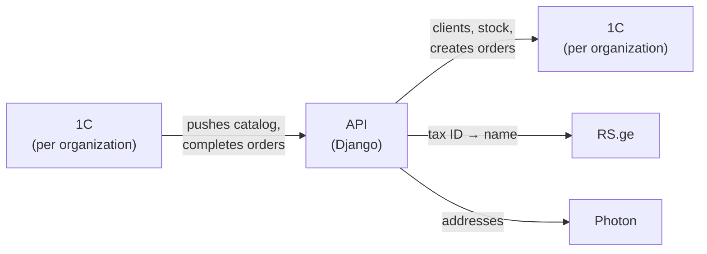

# Architecture & product design

Diagrams of the system as it is built, derived from the code on `djangoRewrite`.
All diagrams are [Mermaid](https://mermaid.js.org/) and render natively on GitHub
and in most Markdown previewers. Each diagram makes one point and stays small;
detail lives in the tables beside it.

Per-feature design rationale lives in [`docs/superpowers/specs/`](../superpowers/specs/);
these pages are the system-wide picture those specs plug into.

| Page | What it shows |
|------|---------------|
| [01 — Use cases](01-use-cases.md) | What each role does, route and API access |
| [02 — Domain model](02-domain-model.md) | The data in three groups: access, sales, catalog |
| [03 — Order lifecycle](03-order-lifecycle.md) | Order states, the confirm checklist, completion |
| [04 — Authentication](04-authentication.md) | Login (IP allowlist, device lock), token refresh, 401 retry |
| [05 — Catalog & product search](05-catalog-and-search.md) | 1C catalog push, replica-first scan lookup, image proxy |

## Who uses it

```mermaid
flowchart LR
    consultant(["Consultant"])
    companyAdmin(["Company admin"])
    internalAdmin(["Internal admin"])

    spa["Web app<br/>(React)"]
    djadmin["Django admin"]
    api["API<br/>(Django)"]
    db[("PostgreSQL")]

    consultant -- "sells" --> spa
    companyAdmin -- "sells, manages org" --> spa
    internalAdmin -- "manages all orgs" --> spa
    internalAdmin -- "back office" --> djadmin
    spa -- "JWT" --> api
    djadmin --> db
    api --> db
```

## What it talks to



The same 1C service appears on both sides on purpose: the app **calls** 1C for
live data, and 1C **calls back** with a per-org push token for catalog updates
and order completion. PostHog (product analytics) and Sentry (errors, optional)
receive telemetry only and are left off the diagram.

## Key design points

- **Multi-tenant by `Organization`.** Every business row hangs off an org; views
  scope querysets by `request.user.organization` in addition to permission classes.
- **1C is the system of record** for clients, stock, prices and posted orders.
  This app keeps a local *replica* of the catalog (pushed by 1C) and denormalized
  client fields on orders, so history and search survive a 1C outage.
- **Two inbound trust models:** users authenticate with JWT; 1C authenticates with
  a per-org push token (`Organization.webhook_token`) plus an optional IP allowlist.
