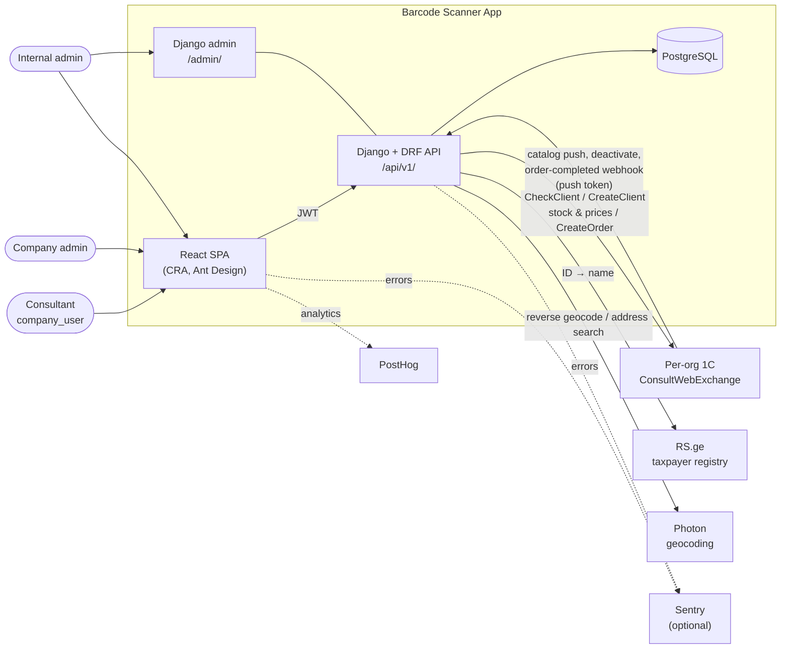

# Architecture & product design

Diagrams of the system as it is built, derived from the code on `djangoRewrite`
(2026-09-14). All diagrams are [Mermaid](https://mermaid.js.org/) and render
natively on GitHub and in most Markdown previewers.

Per-feature design rationale lives in [`docs/superpowers/specs/`](../superpowers/specs/);
these pages are the system-wide picture those specs plug into.

| Page | What it shows |
|------|---------------|
| [01 — Use cases](01-use-cases.md) | Actors, what each role can do, route access |
| [02 — Domain model](02-domain-model.md) | ER diagram of `users` + `core` models, tenancy boundaries |
| [03 — Order lifecycle](03-order-lifecycle.md) | Order state machine, confirm → 1C push, completion webhook |
| [04 — Authentication](04-authentication.md) | Login (IP allowlist, device lock), token refresh, 401 retry |
| [05 — Catalog & product search](05-catalog-and-search.md) | 1C catalog push, replica-first scan lookup, image proxy |

## System context

**Key design points**

- **Multi-tenant by `Organization`.** Every business row hangs off an org; views
  scope querysets by `request.user.organization` in addition to permission classes.
- **1C is the system of record** for clients, stock, prices and posted orders.
  This app keeps a local *replica* of the catalog (pushed by 1C) and denormalized
  client fields on orders, so history and search survive a 1C outage.
- **Two inbound trust models:** users authenticate with JWT; 1C authenticates with
  a per-org push token (`Organization.webhook_token`) plus an optional IP allowlist.
